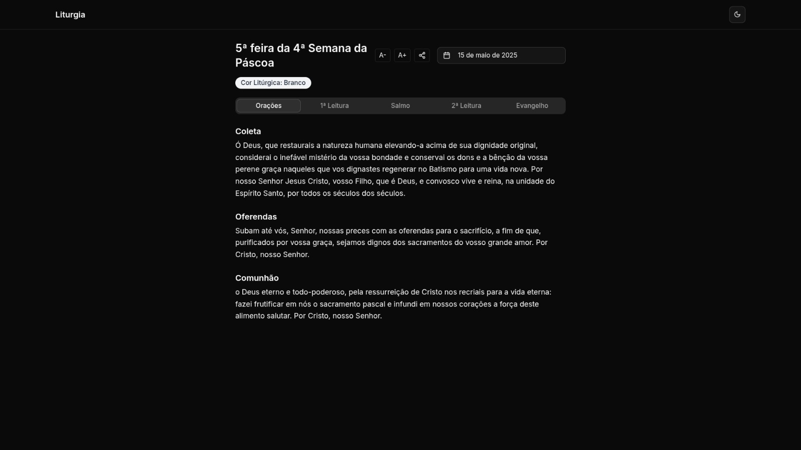

# Liturgia Diária

Neste projeto você poderá ter acesso de forma simples e intuitiva a liturgia diária da igreja Católica Apostólica Romana. O site conta com link de compartilhamento, acessibilidade para aumentar e diminuir a fonte, tema claro e escuro além de disponibilizar a cor do dia e calendário para selecionar qualquer data.

## API
A api pública utilizada foi a [liturgia-diaria](liturgia.up.railway.app/v2/) desenvolvida pelo [@Dancrf](https://github.com/Dancrf).

## Demo

